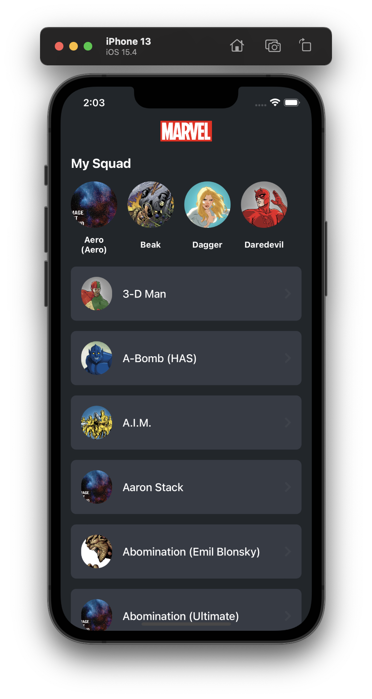
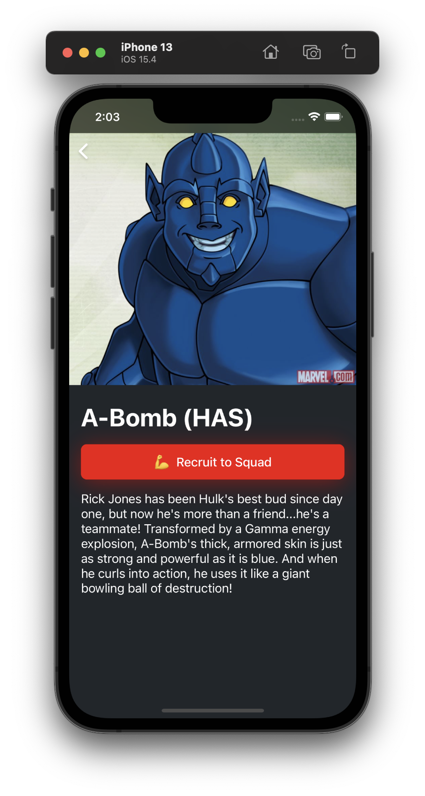

# Marvel test app

## Mission
This app use [Marvel API](https://developer.marvel.com/docs) to load and show list of comics characters. You can hire the characters to your team and you will see all memebers of your team.

## Tech stack
- Swift 5
- MVVM with Coordinators
- UIKit
- Combine
- Compositional layout
- Core Data

## Screenshots
<table>
  <tr>
    <th width="50%"></th>
    <th width="50%"></th>
  </tr>
</table>

## Description
This project based on `MVVM` architecture  to increase the speed of adding new features, reduce number of entities (compared to VIPER), improve readability of code and make learning easier for new team members (because a lot of iOS devs are familiar with MVVM).

Also `Coordinator` appear in this project to make more flexible routing between features and make it isolated from each other.

App based on `UIKit` because this allow to keep iOS target version as small as possible and cover wide group of people. 

`Combine` helps to make reactive approach for processing data. It saves us from 'callback hells' and helps to make clear data process pipeline.

`CoreData` is used to store squad member info. Number of members in squad can be huge and local database can handle it perfect unlike of other approach to store data (for example UserDefaults). CoreData allows to fetch/delete/update by batches and it can be helpful to build new features.

This is small app and number of external libraries is small. External library can be abandoned by it creator and team should be support or make own library.

### Root View
`List Scene` - load and show characters in the list and show your squad members in horizontal scroll. `ListViewModel` call a few functions of `CharactersService` and show returned data. Also this screen can handle and show network errors in order to make user experience greater. View based on compositional layout to support horizontal and vertical scroll in the same time, also it helps to easily integrate and display new data sources.

### Details
`Details Scene` - show information about character. You can hire or fire character from you squad on this screen. 

### CharacterService
`CharacterService` is umbrella around few providers with additional business logic. This service can load characters, add/remove character from your squad and other.

## Tests
This app is covered by unit tests. Tests cover all functions of providers and services. You can find tests in `MarvelTests` folder.